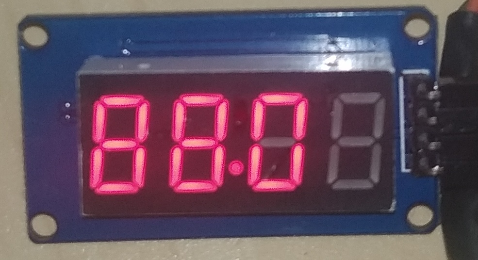

# Time Machine - Speedometer


Speedometer is an Arduino library used to emulate Back to the Future's Delorean time machine digital speedometer using a 7-Segment 4 digit display to run from 0 to 88mph.
It has been created to place it on a scale model car.

If you like **Speedometer**, give it a star, or fork it and contribute!

[](https://paypal.me/zerfoinder)

## Installation

1. Navigate to the Releases page.
1. Download the latest release.
1. In the Arduino IDE, navigate to Sketch > Include Library > Add .ZIP Library

## How it works

Speedometer uses a 7-Segment 4 digit display (TM1637). In order to keep screen accuracy, only first three digits are used to show speed number.
It is possible to show any number between 00.0 to 88.0 mph.



**Note**: It is the responsibility of the user to generate the code send instructions to display at desired time.


## Usage

```C++
#include <Speedometer.h>  // Add include to Speedometer.h

using namespace bttf::timemachine;  // Add using namespace

//Create SpeedoPins struct and initialize them with pin numbers
SpeedoPins speedoPins = { 11, 12}; // { clock, data };

// Create Speedometer object, pass speedoPins as parameter.
Speedometer speedo(speedoPins);

void setup() {
    speedo.init();   // ALWAYs call init() method in setup()
}

void loop() {

    speedo.setValue(10); // set value to 10.0

    speedo.loop(); // Call tree.loop() ALWAYS in the end of sketch loop().
}
```

## Components and functions
### Speedometer Class
#### Example
```C++
XmasTree tree; // create an object called: tree. (No parameters are required).
```

#### Public methods
| Method | Description |
| ---------- | ----------- |
| `Speedometer speedo(speedoPins);` | Constructor. It receives a `SpeedoPins` struct. |
| `.init();` | Initialize Speedometer, it should run always in setup() section. |
| `.on();`   | Turns on Speedometer. |
| `.off();`  | Turns off Speedometer. |
| `.brighter(unsigned long duration));`  | Turns on Speedometer brighter. During specified duration (milliseconds). |
| `.blink();`  | Turns on Speedometer blinking. |
| `.state();`    | Returns the current state of Speedometer. returns [off, on, bright, blinking or moving]. |
| `.setValue(int value);`    | Set Speedometer level (any value from 0 to 88). |
| `.getValue();`    | Returns the current int value. |
| `.moveTo(int newValue, unsigned long duration);`    | Moves from current value to new value in specified time (milliseconds). |
| `.loop();`    | function used to manage concurrent actions. It should be ALWAYS added in the end of sketch loop() method. |

## Contributing
Pull requests are welcome. For major changes, please open an issue first to discuss what you would like to change.

[](https://paypal.me/zerfoinder)

## License
This library is licensed under [GPLv3](https://www.gnu.org/licenses/quick-guide-gplv3.html).
